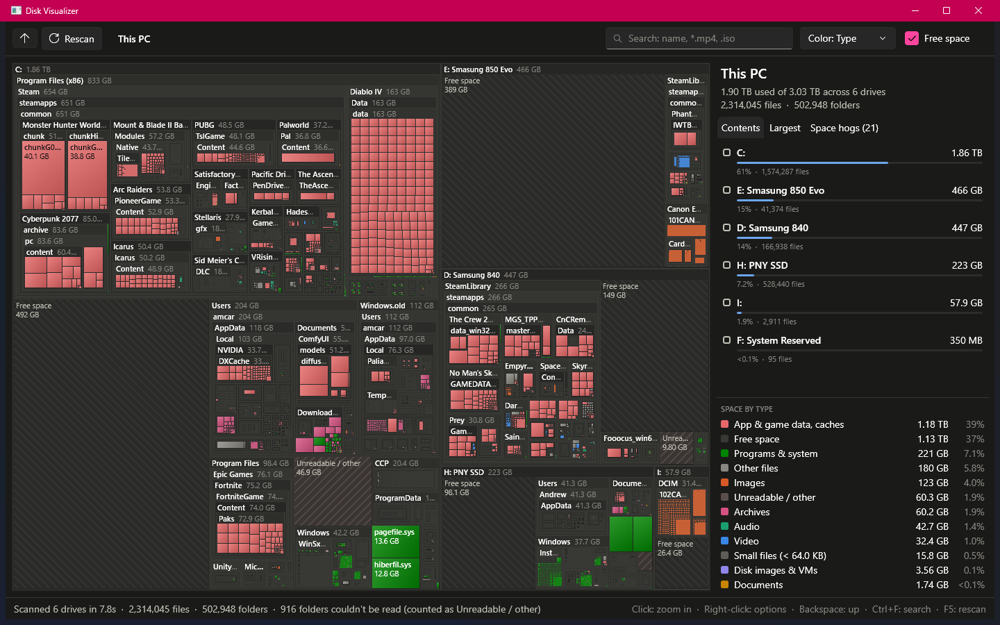

# Disk Visualizer

A fast, read-only Windows app that scans every fixed and removable drive and shows where the space went as an interactive treemap.



## Features

- **All drives at once.** Box area is proportional to size; folders nest inside folders, files are colored by type. Free space and "Unreadable / other" blocks make each drive's area match its real capacity.
- **Fast, parallel scan.** Runs as a normal user; protected folders show up as "Unreadable / other". Roughly 2.3 million files across 6 drives in about 8 seconds with a warm cache. Drives appear as they finish, and a slow or unready drive doesn't block the others.
- **Run as admin (optional).** One click restarts the app elevated with the backup privilege on, so protected folders (System Volume Information, other users' profiles, …) are included. On the author's PC that took "Unreadable / other" from about 60 GB to 1.3 GB. Still read-only.
- **Drives stand out.** Each drive is framed with its own title band and capacity bar; drives over 90% full turn red.
- **Light and dark themes.** Follows Windows on first launch; the toolbar toggle remembers your choice.
- **Drill down.** Click to zoom into a folder; use the breadcrumbs, Backspace, or the mouse back button to go up. Right-click to open in Explorer or copy a path.
- **Search and filter.** Plain text, `*.mp4`-style wildcards, or `.iso` for an extension. Matches stay lit, everything else dims, and the toolbar shows the count and total size.
- **Largest tab.** The top 200 files (filterable by type) or folders in the current view.
- **Color by age.** Shades files by last-modified date, from under a week to over 3 years, so stale data stands out.
- **Space hogs.** Finds well-known space consumers (`Windows.old`, Windows Update downloads, shader caches, package caches, `node_modules`, WSL/Docker disks, the hibernation file and more). Each card says whether it's safe to clear and how to reclaim the space. The app itself never deletes anything.

## Running it

### Portable exe

Build one self-contained exe that runs on any 64-bit Windows 10/11 PC, with nothing to install:

```powershell
dotnet publish -p:PublishProfile=Portable
```

This writes `publish/DiskVisualizer.exe` (about 60 MB), which you can copy anywhere, such as a USB stick. On first run it unpacks a few WPF graphics DLLs to `%TEMP%\.net`. Your theme choice is saved next to the exe in `DiskVisualizer.settings.json`, so it travels with it; if that folder isn't writable, it's saved in `%LocalAppData%\DiskVisualizer` instead.

### From source

Building requires the [.NET 10 SDK](https://dotnet.microsoft.com/download/dotnet/10.0).

```powershell
dotnet run -c Release
```

## Notes and limits

- Folders you don't have permission to read are counted under **Unreadable / other** (used space minus everything that could be counted). Run as admin to include them.
- Files under 64 KB are grouped into one block per folder to keep memory down, so search can't find them individually.
- Sizes are logical file sizes, not size on disk. Hard-linked files (mostly in `C:\Windows\WinSxS`) are counted once per link.
- Cloud-only OneDrive placeholders count as 0 bytes, since they use no local space.

## Code layout

| Path | What it does |
|---|---|
| `src/Scanning/DriveScanner.cs` | Multi-threaded directory scan and size roll-up |
| `src/Treemap/TreemapControl.cs` | Squarified nested treemap layout, drawing, and hit testing |
| `src/Treemap/Theme.cs` | Colors for file types, age, and status badges |
| `src/Model/` | Tree nodes, file categories, search, the Largest query, and space-hog rules |
| `src/Platform/` | Elevation and backup privilege, and saved settings |
| `MainWindow.xaml(.cs)` | Toolbar, side panel, tooltips, and navigation |
